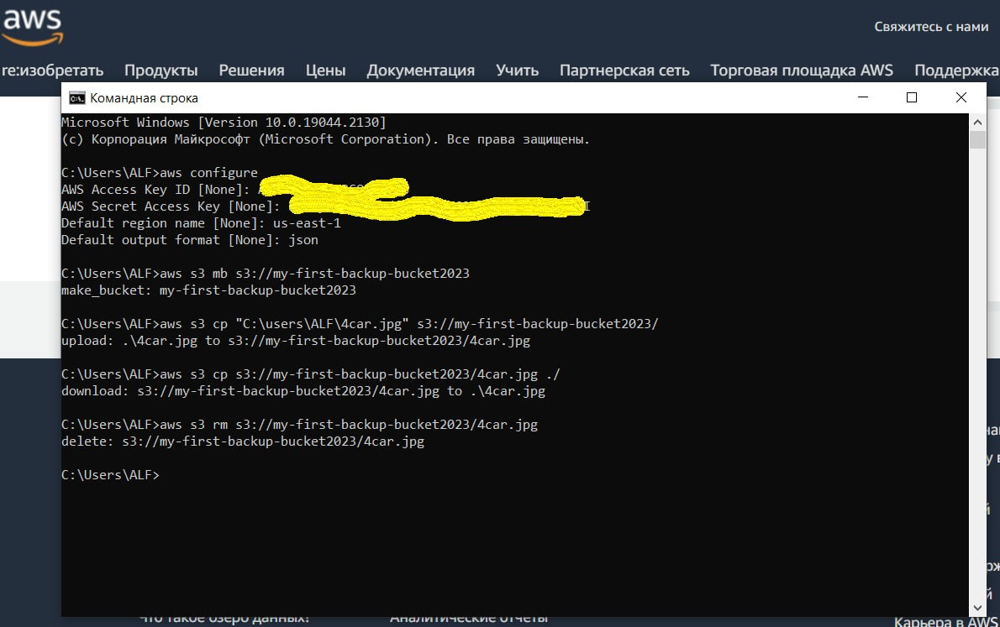

## EPAM University Programs
### Cloud&DevOps Fundamentals Autumn 2022
### AWS Cloud Basic

1. Read the terms of Using the AWS Free Tier and the ability to control their own costs.
2. Register with AWS.
3. Review Getting Started with Amazon EC2. Log Into My AWS Account, Launch, Configure, Connect and Terminate My Instance. 

 

Connect to My Instance.

 

4. Create a snapshot of your instance to keep as a backup.
   
 

5. Create and attach a Disk_D (EBS) to your instance to add more storage space. Create and save some file on Disk_D.
 

Create and save some file on Disk_D.

6. Launch the second instance from backup.

7. Detach Disk_D from the 1st instance and attach disk_D to the new instance.

8. Launch and configure a WordPress instance.

9. Review the 10-minute Store and Retrieve a File. Repeat, creating your own repository.

10. Review the 10-minute example Batch upload files to the cloud to Amazon S3 using the AWS CLI. Create a user AWS IAM, configure CLI AWS and upload any files to S3.

11. Review the 10-minute example Deploy Docker Containers on Amazon Elastic Container Service (Amazon ECS). Repeat, create a cluster.

Run the online demo application or better other application with custom settings.

12. Run a Serverless "Hello, World!" with AWS Lambda.

13. Create a static website on Amazon S3, publicly available. Post on the page your own photo, the name of the educational program (EPAM Cloud&DevOps Fundamentals Autumn 2022), the list of AWS services with which the student worked within the educational program or earlier and the full list with links of completed labs.

Link: http://gusevazhanna.website.s3-website.eu-central-1.amazonaws.com/